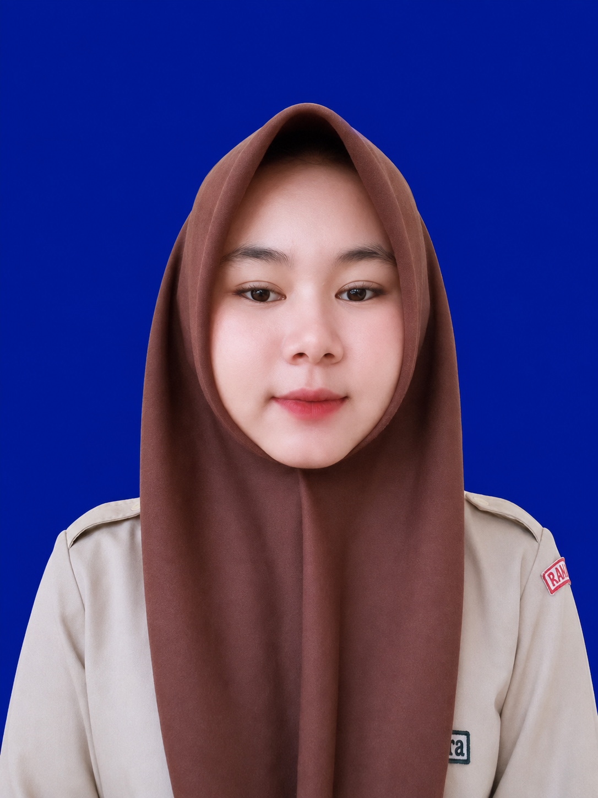

  <!-- Animasi kilauan / hiasan gerak di paling atas -->
  

    

  <!-- Foto profil dengan bingkai rounded & bayangan halus -->
  

    

  <!-- Nama Utama dengan font Times New Roman Kapital -->
  <h1 style="font-family: 'Times New Roman', Times, serif; color: #2c3e50; font-size: 28px; margin-bottom: 5px;">
    SYAIRA NOVKA S
  </h1>

  <!-- Keterangan Status Tanpa Tanda Bintang -->
  

    Mahasiswa Rekayasa Perangkat Lunak (RPL) ✨
  

  
  

    📍 Semparuk, Kalimantan Barat, Indonesia
  

  <!-- Tombol Kontak / Badge Imut -->
  

    
    
  

### 🌸 Tentang Saya

Saya adalah seorang siswi SMK kejuruan yang bertanggung jawab dan disiplin, jurusan Rekayasa Perangkat Lunak. Saya memiliki minat yang kuat dalam teknologi dan pengembangan perangkat lunak, dan saya selalu bersedia mempelajari hal-hal baru.

 

<!-- Hiasan Pembatas Bergerak -->

  

